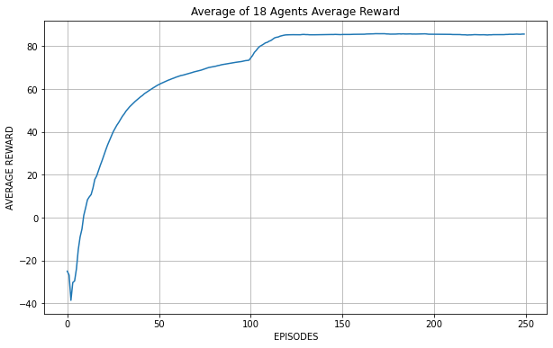

# BathRLProject

This repository contains a tensorflow implementation
of a direct deterministic policy gradients (DDPG) algorithm which has been applied to the 'MountainCarContinuous-v0' 
environment from gym.openai.com.

This project was an assessment undertaken at the University of Bath and created by the following team members:
  - Tanmay Burde
  - Mayur Ramjee
  - Johannes Steffens
  - Matthew Morris

## No Training Episode 0

## Trained Agent Episode 200

## Learning Curve

